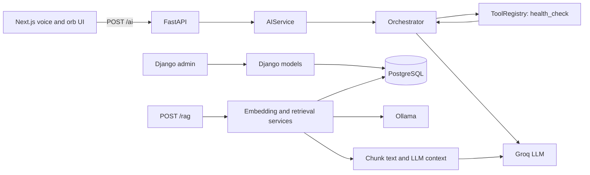

# GROOT — Current architecture

Reviewed: 2026-09-21 at `06c15a9`; static overview, not runtime verification. Local untracked browser files are explicitly distinguished below.

## Service and technology map

| Location | Responsibility and technology |
| --- | --- |
| `frontend/` | Next.js 16.3, React 19.2, TypeScript, Tailwind 4; Three.js/React Three Fiber orb; browser speech APIs; MediaPipe gestures |
| `backend/config/`, `backend/core/` | Django 6.1 business models/admin, integration and document services, Celery configuration/tasks |
| `ai_engine/app/` | FastAPI, Pydantic HTTP models, provider/tool abstractions, RAG, standalone agent/control modules |
| `ai_engine/app/db/`, `models/`, `alembic/` | SQLAlchemy/psycopg, PostgreSQL pgvector embeddings, Alembic ownership of AI tables |
| `infrastructure/redis/` | Redis configuration; Django uses Redis database 0 as Celery broker and 1 for results |
| `docs/` | Product, architecture, engineering rules, design, roadmap, compact memory |

Versions above are manifest declarations, not independently verified compatibility. Python dependencies for both services are in [backend/requirements.txt](../backend/requirements.txt). It currently omits the imported `langchain_core`, `langchain_groq`, and `langgraph` packages. No Docker/Compose, Kubernetes, CI pipeline, or MongoDB implementation was found. Root `scripts/` and `tests/` are empty; tests reside beside the services.

## HTTP path that exists today

- `GET /health`: fixed AI engine health payload; not a dependency readiness check.
- `POST /ai`: requires UUID `user_id`, `organization_id`, `request_id`, and `message`; returns `LLMResponse` (`text`, `tool_calls`). The orchestrator supports an initial LLM call, tool execution, and one follow-up call, not an autonomous loop.
- `POST /rag`: same fields plus `top_k` (default 5); returns `query`, assembled `context`, and `response`. The UI currently calls `/ai`, not `/rag`.
- Django routes only `/admin/`; `core/views.py` remains a placeholder.

[FastAPI entry point](../ai_engine/app/main.py) allows local frontend origins on ports 3000/3001. It has no authentication dependency. Request UUIDs are supplied by callers and are not mapped to Django's integer user/organization keys. Blocking provider/database calls are currently made inside async route functions.

## Storage ownership and knowledge flow

Django owns users, organizations/memberships, teams, customers, projects/tasks, events/risks, integrations, documents, extracted content, and chunks. Django migrations manage these tables. The AI engine owns `document_chunk_embeddings`, managed by Alembic; its autogeneration filter limits reflected tables to that AI table.

The services expect access to the same PostgreSQL database: [RAGDocumentService](../ai_engine/app/services/rag_document_service.py) reads Django's `core_documentchunk` table directly through parameterized SQL. Embeddings reference integer chunk IDs without a database foreign key. `(document_chunk_id, model)` is unique; dimensions are stored separately in a variable-dimension pgvector column. The migration assumes the database already has the vector extension available.

Document preparation and retrieval are separate paths:

1. Django `process_document` task → text/PDF extractor → normalization → deterministic text chunks → Django persistence.
2. AI `DocumentChunkEmbeddingService` → configured embedding provider → AI embedding rows. No call from the document pipeline to this service was found.
3. Query → embedding → cosine search filtered by model/dimensions → chunk text lookup → assembled context → LLM answer.

Ollama defaults to `nomic-embed-text:latest`, 768 dimensions, batch size 32, local server port 11434. These are configured defaults, not a fresh live verification. The local provider creates deterministic hash vectors for development, not semantic embeddings.

Two answer-composition paths remain: `AIService.handle_rag()` and `RAGService.answer()`; both use the shared retrieval primitives. KnowledgeAgent uses the latter. Neither similarity search nor chunk lookup applies organization scope. Reprocessing deletes/recreates Django chunks, while embedding cleanup/replacement is not coordinated, allowing stale references. Embedding writes insert rather than upsert.

## Integrations and background jobs

GitHub is the only concrete connector: environment credentials → integration registry/service → HTTP GET → repository-shaped normalized events → ingestion service → event persistence. Events with external IDs are upserted by organization/source/external ID; events without an external ID are appended. Other `Integration.Provider` values do not have connector implementations.

Celery defines health, ingestion, and document tasks. Configuration autodiscovers `core.tasks`; nested `core.ingestion.tasks` and `core.documents.tasks` are not explicitly imported there. Worker registration of those tasks needs validation. No recurring ingestion schedule, agent job pipeline, or automated embedding queue was found.

## Agent and control components outside HTTP routing

`AgentSelection` supplies names → `MultiAgentCoordinator` → `AgentSupervisor` → one `AgentGraph` per selected agent → `AgentResult` tuple. Execution is sequential. LangGraph wraps a single execution node; there is no checkpointer, branching, pause/resume, or automatic planning. Agent state may contain a live SQLAlchemy session and is not a durable workflow representation.

The LangChain Groq adapter implements GROOT's `LLMProvider`; `AIService` still defaults to the direct Groq adapter. Equaliator compares result summaries and evidence presence; contradiction detection always returns an empty tuple. `AgentEvaluator` scores result fields. Permission, approval, action, verification, and audit components are not connected to this HTTP flow. Audit storage is an in-memory list.

## Configuration gaps and external dependencies

- Root `.env.example` covers PostgreSQL and embeddings, but omits `GROQ_API_KEY`, `GITHUB_TOKEN`, and frontend `NEXT_PUBLIC_AI_ENGINE_URL`.
- AI database configuration loads environment values; Django database and Redis settings are hard-coded. Align these explicitly when running both services.
- Django production settings only disable debug and leave allowed hosts empty; the base secret is a development constant.
- MediaPipe loads WASM/model assets from external URLs. Microphone/camera and speech support depend on browser capabilities and permission.

## Planned architecture, not current wiring

Authenticated request → orchestrator/selection → specialized agents with controlled tools → Equaliator → synthesis → persisted approval where required → real action → independent verification. Preserve Django business-data ownership and the existing SQLAlchemy/RAG foundation. Add persistence, background execution, tracing, and browser drivers incrementally. MongoDB, MCP, additional specialist agents, and container orchestration remain unimplemented possibilities.
