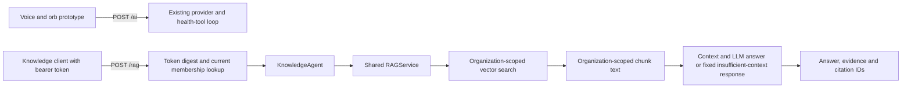

# GROOT — Current architecture

Verified: 2026-09-28 against `3c42b23` plus uncommitted knowledge-flow changes. Unit tests, PostgreSQL/pgvector integration tests, both migration systems and task registration were exercised. External providers and running workers were not exercised.

## Services and ownership

| Location | Responsibility |
| --- | --- |
| `frontend/` | Next.js 16.3 / React 19.2 voice/orb/gesture prototype; calls `/ai` |
| `backend/` | Django 6.1 models/admin, memberships and token issuance, integrations, document processing and Celery jobs |
| `ai_engine/app/` | FastAPI, provider/tool contracts, KnowledgeAgent, embedding and RAG services, standalone agent/control modules |
| `ai_engine/app/db/`, `models/`, `alembic/` | Existing SQLAlchemy engine, SessionLocal/Base, AI-owned vector table and migrations |
| `infrastructure/redis/` | Redis configuration; local Celery broker/result defaults use databases 0/1 |

Django owns business, document, chunk, membership and `core_knowledgeaccesstoken` tables. Alembic owns `document_chunk_embeddings`. AI reads Django tables through parameterized SQL. No new database engine or workflow framework was introduced. Python dependencies and runtime setup completed in `3c42b23` remain in place.

## HTTP flows

```mermaid
flowchart LR
    UI[Voice and orb prototype] -->|POST /ai| AI[Existing provider and health-tool loop]
    CLIENT[Knowledge client with bearer token] -->|POST /rag| AUTH[Token digest and current membership lookup]
    AUTH --> AGENT[KnowledgeAgent]
    AGENT --> RAG[Shared RAGService]
    RAG --> SEARCH[Organization-scoped vector search]
    SEARCH --> TEXT[Organization-scoped chunk text]
    TEXT --> ANSWER[Context and LLM answer or fixed insufficient-context response]
    ANSWER --> EVIDENCE[Answer, evidence and citation IDs]
```

- `GET /health`: fixed health payload; no dependency readiness probe.
- `POST /ai`: existing UUID user/organization/request fields and message; one tool round, direct Groq adapter, global registry contains only `health_check`. This demo route has no company-document retrieval.
- `POST /rag`: bearer authentication; body contains UUID `request_id`, nonblank `message` (up to 12,000 characters), optional `top_k` (1–50, default 5). Extra fields, including claimed user/organization IDs, are rejected. Response preserves `query`, `context`, `response` and adds chunk `evidence` and integer `citations`.
- `/rag` uses synchronous FastAPI dependencies/handler for blocking database/provider operations. `/ai` remains the original async route with blocking provider calls.
- Django HTTP routes remain `/admin/`; credential issuance is a management command, not a new login endpoint. Local CORS settings are unchanged.

`KnowledgeAccessToken` holds a unique SHA-256 digest, membership foreign key and expiry. `issue_knowledge_token` creates 32 random bytes encoded for transport, with 1–168 hour lifetime (default 24). FastAPI hashes the bearer credential and joins token → membership → active user, checking expiry on every request. Expired, unknown, revoked or inactive-user credentials return 401. Removing membership cascades token deletion. Current membership supplies user ID, organization ID and role; all authenticated members may read knowledge in that organization. Knowledge access grants no action permission.

`AgentContext` and `AIRequestContext` accept integer identities for this trusted path and retain UUIDs for old prototype contracts. No UUID-to-integer coercion is attempted. Missing integer scope cannot access stored documents.

## Document processing and embeddings

1. Existing `process_document` runs the extraction/normalization/chunk pipeline inside a Django transaction with a document-row lock.
2. Chunk replacement invalidates embedding readiness and deletes old chunks. Alembic's `embedding_chunk_fk` cascades deletion of associated vectors.
3. On successful commit, `enqueue_document_embeddings` dispatches `embed_document`. Extraction's existing READY result is preserved; `Document.embedding_status` and `embedding_error` track embedding work separately.
4. The job locks the same Django document row, loads current ordered chunks and calls `DocumentChunkEmbeddingService.upsert_chunks` using the existing AI `SessionLocal`.
5. `EmbeddingService` validates every batch before writes, then upserts by `(document_chunk_id, model)` in one SQLAlchemy transaction. Write failures roll back; retries keep row identity/created time and replace vector/dimensions/update time.
6. Django marks embedding readiness only after the AI transaction succeeds. A failed provider/database/validation operation records a generic error and propagates the exception. Runtime/provider and SQLAlchemy failures retry at most three times with backoff; validation/configuration errors require correction.

The document lock spans provider calls and the AI transaction, so processing and embedding for one document serialize. A duplicate/delayed job processes current chunks rather than carrying stale chunk payloads. Foreign keys also prevent direct orphan inserts and handle document deletion through chunk deletion.

Celery now defers autodiscovery until Django initializes; `core.tasks` imports health, document-processing, document-embedding and ingestion tasks. Fresh worker-style loader tests verify all four registrations. Django settings add the repository root to the import path so backend-launched workers can reuse AI services. No scheduler or durable dispatch outbox was added. Broker dispatch failures are recorded on the document; crashes between commit and dispatch, or worker loss, can leave work requiring manual retry.

## Retrieval and answer composition

Similarity search retains matching model/dimensions and cosine ordering. A parameterized `EXISTS` join through `core_documentchunk` and `core_document` requires the authorized organization plus ready extraction/embedding status **before** top-k is applied. `RAGDocumentService` checks that scope again when loading text. Missing scope gives no stored results; invalid nonpositive/noninteger scope is rejected. Scoped RAG ignores caller-supplied text maps and reloads authorized text.

`AIService.handle_rag` now delegates to `RAGService.answer`; KnowledgeAgent uses the same composition. Empty assembled context produces a fixed insufficient-context answer without an LLM call. Nonempty context still uses the existing LLM prompt; semantic answer correctness is not independently verified. Evidence preserves chunk IDs/text/similarity and citations refer to those chunks. The existing nominal 12,000-character context budget is unchanged.

## Migrations and rollout

- Django `0013_knowledge_flow`: token model and document embedding status/error. Existing documents become embedding-pending and need an embedding job before scoped retrieval can return them.
- Alembic `b17d32a0e901`: removes legacy orphan embeddings, then adds `ON DELETE CASCADE` from vector chunk IDs to Django chunks. Downgrade removes the constraint; deleted orphans cannot be restored.
- The SQLAlchemy model references a Django chunk table in separate reference-only metadata. Django tables are not added to AI `Base.metadata`; Alembic's ownership filter remains. Its environment can accept an explicit connection for test-database migrations.
- Apply Django migrations, ensure vector is enabled, then run Alembic before starting the flow. Migration tests used only a temporary database; the developer database was not migrated.

## Other components and remaining boundaries

GitHub is still the only concrete connector, with organization/source/external-ID event idempotency. General coordination is sequential and explicitly selected; LangGraph wraps a single node without persistence. ResearchAgent packages state; DataAnalyst/Operations are placeholders. Equaliator is heuristic, contradiction detection is empty, and action execution/verification and audit remain scaffolds or memory-only.

The root dotenv/process-environment precedence, URL escaping, dependency pins and preflight from the setup module remain. The shared embedding provider factory now serves both query and worker paths and honors `OLLAMA_BASE_URL`. Local hash vectors remain nonsemantic. Production secret/host settings still need hardening. No conversation store, durable workflow, MongoDB, MCP, CI, or container deployment was added.

Verification: focused AI 55/55, focused Django 23/23, full AI 191/192 (baseline browser failure), full Django 107/107; migration checks passed. Ruff reports 16 baseline diagnostics and zero new ones. See [MEMORY.md](MEMORY.md) for commands and exact limits.
