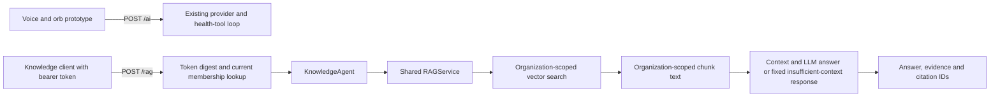
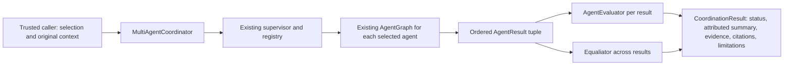

# GROOT — Current architecture

Verified: 2026-09-28. Starting HEAD was clean at `a6d1b6e feat: add trusted read-only tools`. Setup, the knowledge backend and trusted read-only tools are committed. Coordination and Quality is implemented and verified in the working tree; no commit or push was made.

## Services and ownership

| Location | Responsibility |
| --- | --- |
| `frontend/` | Next.js 16.3 / React 19.2 voice/orb/gesture prototype; calls `/ai` |
| `backend/` | Django 6.1 models/admin, memberships and token issuance, integrations, document processing and Celery jobs |
| `ai_engine/app/` | FastAPI, provider/tool contracts, KnowledgeAgent, embedding and RAG services, standalone agent/control modules |
| `ai_engine/app/db/`, `models/`, `alembic/` | Existing SQLAlchemy engine, SessionLocal/Base, AI-owned vector table and migrations |
| `infrastructure/redis/` | Redis configuration; local Celery broker/result defaults use databases 0/1 |

Django owns business, document, chunk, membership and `core_knowledgeaccesstoken` tables. Alembic owns `document_chunk_embeddings`. AI reads Django tables through parameterized SQL. No new database engine or workflow framework was introduced. Python dependencies and runtime setup completed in `3c42b23` remain in place.

## HTTP flows

```mermaid
flowchart LR
    UI[Voice and orb prototype] -->|POST /ai| AI[Existing provider and health-tool loop]
    CLIENT[Knowledge client with bearer token] -->|POST /rag| AUTH[Token digest and current membership lookup]
    AUTH --> AGENT[KnowledgeAgent]
    AGENT --> RAG[Shared RAGService]
    RAG --> SEARCH[Organization-scoped vector search]
    SEARCH --> TEXT[Organization-scoped chunk text]
    TEXT --> ANSWER[Context and LLM answer or fixed insufficient-context response]
    ANSWER --> EVIDENCE[Answer, evidence and citation IDs]
```

- `GET /health`: fixed health payload; no dependency readiness probe.
- `POST /ai`: existing UUID user/organization/request fields and message; one tool round, direct Groq adapter, global registry contains only `health_check`. This demo route has no company-document retrieval.
- `POST /rag`: bearer authentication; body contains UUID `request_id`, nonblank `message` (up to 12,000 characters), optional `top_k` (1–50, default 5). Extra fields, including claimed user/organization IDs, are rejected. Response preserves `query`, `context`, `response` and adds chunk `evidence` and integer `citations`.
- `/rag` uses synchronous FastAPI dependencies/handler for blocking database/provider operations. `/ai` remains the original async route with blocking provider calls.
- Django HTTP routes remain `/admin/`; credential issuance is a management command, not a new login endpoint. Local CORS settings are unchanged.

`KnowledgeAccessToken` holds a unique SHA-256 digest, membership foreign key and expiry. `issue_knowledge_token` creates 32 random bytes encoded for transport, with 1–168 hour lifetime (default 24). FastAPI hashes the bearer credential and joins token → membership → active user, checking expiry on every request. Expired, unknown, revoked or inactive-user credentials return 401. Removing membership cascades token deletion. Current membership supplies user ID, organization ID and role; all authenticated members may read knowledge in that organization. Knowledge access grants no action permission.

`AgentContext` and `AIRequestContext` accept integer identities for this trusted path and retain UUIDs for old prototype contracts. No UUID-to-integer coercion is attempted. Missing integer scope cannot access stored documents.

## Trusted read-only tool layer

`ai_engine/app/tools/read_only/` extends the existing `Tool` and `ToolRegistry`. Each trusted definition supplies a strict Pydantic argument model, `knowledge.read` permission, SQLAlchemy SELECT projection, tenant column and cursor field. The guarded base executor owns validation, authorization, organization filtering, row limit, result paging and rollback. The registry rejects non-read tools, non-SELECT definitions, unsupported permissions and overridden execution methods. Definitions are reviewed server code, not an arbitrary-code sandbox.

`KnowledgeAgent.read_only_tools(context, credentials)` builds a **new registry per request**. Its two names are on that agent's existing allowlist. The factory can also bind another explicitly allowed agent. Credentials and the trusted `AgentContext` are constructor dependencies, never model-visible arguments. `build_tool_schemas` emits the typed schemas for these tools and retains the original empty schema for legacy tools. The existing Orchestrator can consume this registry unchanged; execution checks remain inside each tool even for direct calls. No data tools are registered in the global `/ai` registry, and `/rag` retains its existing RAG execution path.

Each execution opens a dedicated session from the existing `SessionLocal`, sets `SET TRANSACTION READ ONLY` before querying, then reuses `authenticate_knowledge`. The live identity must match both bound integer IDs. Known membership roles (`admin`, `member`) grant only `knowledge.read` to the existing PermissionEngine; unknown roles fail closed. AgentCapabilityPolicy independently requires the agent allowlist and context permission using an explicit tool-permission mapping. The executor adds the organization predicate and bounded LIMIT, materializes the page, rolls back and closes the session on success or failure. It never commits or uses the caller's RAG session.

- `list_documents`: ready extraction and embeddings; ascending ID; safe document metadata; `after_id` and `limit` (default 20, maximum 100).
- `read_document_chunks`: same ready/tenant conditions through a document join; ascending chunk index; IDs/text/truncation flag; `document_id`, `after_index` and `limit` (default 5, maximum 20). Text projection uses PostgreSQL `left(text, 4000)`.
- Both return `{items, next_cursor}` using one extra row to detect continuation. A chunk request for a foreign, missing or unready document returns an empty page without revealing which condition applied.

Query-only SQLAlchemy table expressions read Django-owned tables without entering `Base.metadata`; no models, migrations, engines or dependencies changed. PostgreSQL enforces the read-only transaction even for a modifying CTE embedded in an otherwise valid SELECT (verified SQLSTATE `25006`). Connections return to normal transaction mode after rollback.

## Coordinated investigation and quality

```mermaid
flowchart LR
    CALLER[Trusted caller: selection and original context] --> COORD[MultiAgentCoordinator]
    COORD --> SUP[Existing supervisor and registry]
    SUP --> GRAPH[Existing AgentGraph for each selected agent]
    GRAPH --> RESULTS[Ordered AgentResult tuple]
    RESULTS --> EVAL[AgentEvaluator per result]
    RESULTS --> EQ[Equaliator across results]
    EVAL --> REPORT[CoordinationResult: status, attributed summary, evidence, citations, limitations]
    EQ --> REPORT
```

Execution stays sequential. The coordinator does not replace the task with earlier agents' summaries or inject results into context state. The same original AgentContext object reaches each agent. Context state may contain a live Session; registered agents are trusted code and must not mutate the shared context.

`AgentSupervisor.execute` has optional `capture_failures=False`, preserving direct callers' existing exception behavior. The coordinator opts in to capture failures so missing agents, raised Exceptions and invalid result identities become failed AgentResults at their selected positions; subsequent agents still run. Raw exception messages are omitted because they can contain credentials or SQL inputs. Process-control BaseExceptions are not intercepted.

CoordinationResult is extended, rather than introducing parallel agent/evaluation models. Its original `selection` and `results` remain. Added fields are ordered `evaluations`, aggregate `quality`, overall `status`, `summary`, flattened `evidence`, flattened `citations`, and `limitations`. Original AgentResults remain intact, including failed/unsupported evidence and metadata; flattened collections retain order and duplicates. Per-result provenance remains in `results`.

`evaluation/support.py` provides shared deterministic support checks. AgentEvaluator keeps success/confidence/evidence/errors metrics and adds `groundedness` (1 for verified literal text, 0 for support findings, null when text checking is unavailable or the result failed). Findings include result errors, missing/blank evidence/summary, invalid confidence and unmatched text/citations. A passed evaluation requires success and no findings. Missing confidence stays null; invalid finite/range/type values produce findings and null metric values.

Equaliator reuses its existing result/assessment models. Unsupported results, errors, invalid confidence and detected conflicts block its preliminary completion flag. Evidence quality requires usable evidence from every successful error-free agent to be HIGH. Reported confidence averages valid values only from successful error-free results. Agreement compares normalized successful error-free summary wording, with CONFLICT for detected opposite-polarity clauses. Support checks cover summary text and explicit citation references, not arbitrary data fields or independent source truth.

The coordinator applies a stricter completion gate than Equaliator's legacy structural flag: every result must also pass AgentEvaluator and contain evidence text. Thus a source-label-only result can retain legacy structural support while the overall investigation remains incomplete. Status precedence is empty → incomplete; no successful error-free results → failed; mixed execution outcomes → partial; all checks plus text → complete; otherwise incomplete. Missing confidence alone does not block completion, and no confidence threshold is invented.

Synthesis is deterministic attribution of checked original summaries. Failed or unsupported summaries are omitted; any detected contradiction withholds combined conclusions. Evidence and findings remain available for review. Neither quality scores nor `additional_agent_needed` dispatch tools, actions or more agents.

This remains a server-side API. Existing callers authenticate before supplying KnowledgeAgent context; bound read tools independently recheck their credentials and policy on every execution. The coordinator does not grant permissions or add an authentication endpoint. `/rag`, `/ai`, data ownership, sessions, models and migrations retain their existing contracts. Real PostgreSQL integration covers KnowledgeAgent plus a registered agent using the existing read-only tool registry, tenant isolation and revocation between reads.

## Document processing and embeddings

1. Existing `process_document` runs the extraction/normalization/chunk pipeline inside a Django transaction with a document-row lock.
2. Chunk replacement invalidates embedding readiness and deletes old chunks. Alembic's `embedding_chunk_fk` cascades deletion of associated vectors.
3. On successful commit, `enqueue_document_embeddings` dispatches `embed_document`. Extraction's existing READY result is preserved; `Document.embedding_status` and `embedding_error` track embedding work separately.
4. The job locks the same Django document row, loads current ordered chunks and calls `DocumentChunkEmbeddingService.upsert_chunks` using the existing AI `SessionLocal`.
5. `EmbeddingService` validates every batch before writes, then upserts by `(document_chunk_id, model)` in one SQLAlchemy transaction. Write failures roll back; retries keep row identity/created time and replace vector/dimensions/update time.
6. Django marks embedding readiness only after the AI transaction succeeds. A failed provider/database/validation operation records a generic error and propagates the exception. Runtime/provider and SQLAlchemy failures retry at most three times with backoff; validation/configuration errors require correction.

The document lock spans provider calls and the AI transaction, so processing and embedding for one document serialize. A duplicate/delayed job processes current chunks rather than carrying stale chunk payloads. Foreign keys also prevent direct orphan inserts and handle document deletion through chunk deletion.

Celery now defers autodiscovery until Django initializes; `core.tasks` imports health, document-processing, document-embedding and ingestion tasks. Fresh worker-style loader tests verify all four registrations. Django settings add the repository root to the import path so backend-launched workers can reuse AI services. No scheduler or durable dispatch outbox was added. Broker dispatch failures are recorded on the document; crashes between commit and dispatch, or worker loss, can leave work requiring manual retry.

## Retrieval and answer composition

Similarity search retains matching model/dimensions and cosine ordering. A parameterized `EXISTS` join through `core_documentchunk` and `core_document` requires the authorized organization plus ready extraction/embedding status **before** top-k is applied. `RAGDocumentService` checks that scope again when loading text. Missing scope gives no stored results; invalid nonpositive/noninteger scope is rejected. Scoped RAG ignores caller-supplied text maps and reloads authorized text.

`AIService.handle_rag` now delegates to `RAGService.answer`; KnowledgeAgent uses the same composition. Empty assembled context produces a fixed insufficient-context answer without an LLM call. Nonempty context still uses the existing LLM prompt; semantic answer correctness is not independently verified. Evidence preserves chunk IDs/text/similarity and citations refer to those chunks. The existing nominal 12,000-character context budget is unchanged.

## Migrations and rollout

- Django `0013_knowledge_flow`: token model and document embedding status/error. Existing documents become embedding-pending and need an embedding job before scoped retrieval can return them.
- Alembic `b17d32a0e901`: removes legacy orphan embeddings, then adds `ON DELETE CASCADE` from vector chunk IDs to Django chunks. Downgrade removes the constraint; deleted orphans cannot be restored.
- The SQLAlchemy model references a Django chunk table in separate reference-only metadata. Django tables are not added to AI `Base.metadata`; Alembic's ownership filter remains. Its environment can accept an explicit connection for test-database migrations.
- Apply Django migrations, ensure vector is enabled, then run Alembic before starting the flow. Migration tests used only a temporary database; the developer database was not migrated.

## Other components and remaining boundaries

GitHub is still the only concrete connector, with organization/source/external-ID event idempotency. Coordination remains explicitly selected and sequential; LangGraph wraps a single node without persistence. Quality assessment is now connected with the deterministic limits above. ResearchAgent packages state; DataAnalyst/Operations are placeholders. Action execution/verification and audit remain scaffolds or memory-only.

The root dotenv/process-environment precedence, URL escaping, dependency pins and preflight from the setup module remain. The shared embedding provider factory now serves both query and worker paths and honors `OLLAMA_BASE_URL`. Local hash vectors remain nonsemantic. Production secret/host settings still need hardening. No conversation store, durable workflow, MongoDB, MCP, CI, or container deployment was added.

Verification: 29 new AI tests; focused AI selection 103/103; new PostgreSQL coordination tests 7/7; full AI 231/232 (same baseline browser failure); full Django 126/126. Django/Alembic drift, offline migration SQL, compilation and diff checks passed. Changed-file lint reports zero diagnostics. See [MEMORY.md](MEMORY.md) for commands, baseline comparison and known untouched-file diagnostics.
